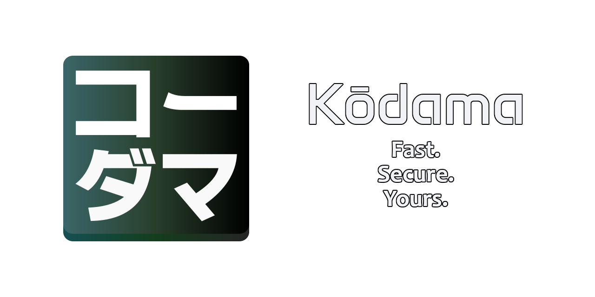

# Kōdama - Modern IDE with Integrated AI Assistant

Kōdama is an Integrated Development Environment (IDE) built with modern web technologies, featuring seamless integration of Large Language Models (LLMs) as intelligent assistants. It prioritizes developer control and privacy by offering robust support for local LLM inference alongside cloud-based options. Kōdama combines a flexible web-based UI with the performance of native code for backend operations, creating a powerful and responsive development tool.

## Key Features

* **Modern Code Editing:** Powered by Monaco Editor for a professional editing experience with features like syntax highlighting, IntelliSense, and more.
* **Integrated AI Assistant:** Interact with LLMs directly within the IDE via a chat interface. Use it for code explanation, generation, refactoring, debugging, and other development tasks.
* **Flexible LLM Integration:**
    * Supports **local inference** via providers like Ollama and KoboldCPP, allowing you to run models offline for maximum privacy and control.
    * Supports **cloud-based inference** via providers like Groq for access to powerful models.
    * Highly configurable model parameters: Temperature, Max Tokens, Top-p/Top-k sampling, Repetition/Presence/Frequency penalties, and custom Stop Sequences.
* **Cross-Platform:** Built using Tauri, Kōdama runs as a native desktop application on Windows, macOS, and Linux.
* **IDE Functionalities:**
    * **File Explorer:** Navigate and manage your project files and directories.
    * **Search:** Perform fast, project-wide searches with options for case sensitivity, whole words, regular expressions, and inclusion of ignored files.
    * **Run Configurations:** Define, save, and execute custom commands, scripts, or build tasks directly from the IDE.
    * **Command Palette:** Access commands and features quickly using a searchable palette (default: `Ctrl+Shift+P`).
    * **Customizable Theming:** Choose from various built-in themes or add your own to personalize the look and feel.
    * **Detailed Settings:** Fine-tune the editor, AI integration, UI, and data handling preferences.

## Technologies Used

* **Frontend:**
    * [Vue.js](https://vuejs.org/)
    * [TypeScript](https://www.typescriptlang.org/)
    * [Vite](https://vitejs.dev/)
    * [Monaco Editor](https://microsoft.github.io/monaco-editor/)
    * [Tailwind CSS](https://tailwindcss.com/)
    * [Pinia](https://pinia.vuejs.org/) (State Management)
    * [marked](https://marked.js.org/) (Markdown Rendering)
    * [highlight.js](https://highlightjs.org/) (Syntax Highlighting)
* **Backend & Desktop Framework:**
    * [Tauri](https://v2.tauri.app/)
    * [Rust](https://www.rust-lang.org)
    * Rayon (Rust Parallelism Library)
    * walkdir / ignore (Rust Directory Traversal Libraries)
* **AI/LLM Integration:**
    * Custom `LLMClient` Interface (supports various providers)
    * [Ollama](https://ollama.com/)
    * [KoboldCPP](https://github.com/LostRuins/koboldcpp/)
    * [Groq](https://groq.com/)

## Getting Started

### Prerequisites

* Node.js (LTS recommended) & npm / yarn / pnpm
* Rust & Cargo (Follow the official Rust installation guide: [https://www.rust-lang.org/tools/install](https://www.rust-lang.org/tools/install))
* **Optional:** For local AI features, install and run an LLM provider like [Ollama](https://ollama.com/) or [KoboldCPP](https://github.com/LostRuins/koboldcpp/).
* **Optional:** For cloud AI features, obtain an API Key from your chosen provider (e.g., Groq).

### Installation & Running

1.  **Clone the repository:**
    ```bash
    git clone clone https://github.com/FabioArdis/Kodama.git
    cd kodama
    ```
2.  **Install frontend dependencies:**
    ```bash
    pnpm install
    ```
3.  **Run in development mode:**
    ```bash
    pnpm tauri dev
    ```
    This will build and launch the application with hot-reloading enabled for the frontend.

4.  **Build for production:**
    ```bash
    pnpm run tauri build
    ```
    The distributable application package will be located in `src-tauri/target/release/bundle/`.

### Platform-Specific Setup

When using Ollama on Windows with Kōdama, you need to set an environment variable to allow communication between the applications. Create a new environment variable named `OLLAMA_API_URL` and set its value to `http://tauri.localhost`.
This step is not necessary on macOS or Linux, as the application can communicate with the Ollama server directly.

### Configuration

* Configure LLM providers (Base URL, API Key), select models, and adjust generation parameters within the application's **Settings** menu.
* Select your preferred UI theme via the **Theme Selector** in Settings.
* Manage Run Configurations via the **Run** panel in the sidebar after a project is loaded.

## Future Roadmap

* **Plugin System:** Develop an API and infrastructure for third-party plugins to extend functionality.
* **Enhanced AI Integration:** Integrate AI assistance more deeply, potentially into the Command Palette or for automated Run Configuration setup.
* **Version Control:** Implement built-in Git support for managing repositories directly within Kōdama.

## Contributing

Contributions are welcome! If you have suggestions, bug reports, or feature requests, please open an issue or submit a pull request. For larger changes, consider discussing your ideas in an issue first.

### Special acknowledgments
- [Carmine Dodaro](https://github.com/dodaro) - My thesis supervisor, for his unwavering support and for believing in me and this project.
- [Burak Tutkun](https://github.com/RShadowhand/) - For showing me the beauty of Vue.js and Tauri, and for his invaluable help in the early stages of this project.
- [FirStorm9](https://github.com/FirStorm9) - For converting me to the dark side of Rust and for testing the application on ArchLinux.

## License

This project is licensed under the MIT License - see the `LICENSE` file for details.